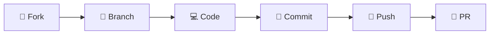

<div align="center">

# 🕉️ The Divine of Ayodhya - Ram Janmabhoomi 🚩

[](https://github.com/awnishkj/the-birth-place-of-RAM/stargazers)
[](https://github.com/awnishkj/the-birth-place-of-RAM/network)
[](https://github.com/awnishkj/the-birth-place-of-RAM/issues)
[](LICENSE)

### 🙏 *"रघुकुल रीत सदा चली आई, प्राण जाय पर वचन न जाई"* 🙏

**A comprehensive spiritual platform dedicated to the sacred city of Ayodhya, the birthplace of Lord Ram**

*Discover • Explore • Experience the Divine Journey*

---

</div>

## ✨ Features & Highlights

<table>
<tr>
<td width="50%">

### 🏛️ **Sacred Places**
```
🕉️ Ram Mandir          - Main temple complex
🏰 Kanak Bhawan        - Sita's golden palace  
🌊 Saryu Ghat          - Holy river banks
🐒 Hanuman Garhi       - Hanuman's fortress
👑 Raja Dasharath Mahal - Royal palace
```

### 🏨 **Accommodation & Services**
```
🏠 Dharmshala    - Religious guest houses
🏨 Hotels        - Modern accommodations
🍽️ Bhojnalaya    - Traditional dining halls
🍴 Restaurants   - Local cuisine options
```

</td>
<td width="50%">

### 🎯 **Digital Experience**
```
📱 Responsive Design    - Works on all devices
🎨 Beautiful UI         - Modern spiritual theme
📧 Contact System       - Email integration
📸 Photo Gallery        - Sacred site images
🗺️ Travel Guide        - Route information
🎁 Prasad Info         - Sacred offerings
```

### 🔧 **Technical Features**
```
⚡ Fast Loading        - Optimized performance
🔒 Secure Forms        - Protected data
🌐 Multi-page App      - Complete navigation
📱 Mobile Friendly     - Touch optimized
```

</td>
</tr>
</table>

## 🛠️ Technology Stack

<div align="center">

| **Frontend** | **Backend** | **Tools & Libraries** |
|:---:|:---:|:---:|
|  |  |  |
|  |  |  |
|  |  |  |

</div>

## 🚀 Quick Start Guide

<div align="center">

### 📋 Prerequisites


</div>

### 📥 Installation

<details>
<summary><b>🔽 Click to expand installation steps</b></summary>

```bash
# 1️⃣ Clone the sacred repository
git clone https://github.com/awnishkj/the-birth-place-of-RAM.git
cd the-birth-place-of-RAM

# 2️⃣ Install Frontend Dependencies
cd frontend
npm install

# 3️⃣ Install Backend Dependencies  
cd ../server
npm install

# 4️⃣ Environment Setup
# Create .env file in server directory
echo "EMAIL_USER=your-email@gmail.com" > server/.env
echo "EMAIL_PASS=your-app-password" >> server/.env
```

</details>

### 🏃‍♂️ Running the Application

<table>
<tr>
<td width="50%">

#### 🖥️ **Development Mode**
```bash
# Terminal 1 - Backend
cd server
npm run dev
# 🌐 Server: http://localhost:5000

# Terminal 2 - Frontend  
cd frontend
npm run dev
# 🌐 Frontend: http://localhost:5173
```

</td>
<td width="50%">

#### 🚀 **Production Mode**
```bash
# Build Frontend
cd frontend
npm run build

# Start Production Server
cd ../server
npm start
```

</td>
</tr>
</table>

## 📁 Project Architecture

<div align="center">

```
🕉️ THE DIVINE OF AYODHYA 🕉️
├── 🎨 frontend/                    # React Spiritual UI
│   ├── 📱 src/
│   │   ├── 🧩 components/         # Sacred UI Components
│   │   ├── 📄 pages/             # Temple Pages
│   │   ├── 🔧 lib/               # Divine Utilities
│   │   └── ⚛️ App.tsx            # Main Temple App
│   ├── 🖼️ public/                # Sacred Assets
│   └── 📦 package.json           # Frontend Dependencies
├── 🖥️ server/                     # Node.js Divine Backend
│   ├── 🚀 server.js              # Express Temple Server
│   ├── 🔐 .env                   # Sacred Environment
│   └── 📦 package.json           # Backend Dependencies
└── 📖 README.md                   # Divine Documentation
```

</div>

## 🎨 Design Philosophy

<div align="center">

| **🎯 Design Principle** | **✨ Implementation** |
|:---:|:---:|
| 📱 **Responsive** | Works seamlessly on all devices |
| 🌙 **Theme Support** | Light/Dark mode with spiritual colors |
| ♿ **Accessible** | WCAG compliant for all devotees |
| 🎭 **Animated** | Smooth divine transitions |

</div>

## 📧 Divine Communication

<table>
<tr>
<td width="50%">

### 📮 **Contact System**
- 📧 Nodemailer integration
- 🔒 Secure Gmail SMTP
- ✅ Form validation
- 🔔 Real-time notifications

</td>
<td width="50%">

### 🛠️ **Available Scripts**
```bash
# Frontend Commands
npm run dev      # 🔥 Development
npm run build    # 📦 Production Build
npm run preview  # 👀 Preview Build

# Backend Commands  
npm run dev      # 🔥 Dev with Nodemon
npm start        # 🚀 Production Server
```

</td>
</tr>
</table>

## 🤝 Contributing to the Divine Mission

<div align="center">

### 🌟 **How to Contribute**



</div>

1. 🍴 **Fork** the repository
2. 🌿 **Create** your feature branch (`git checkout -b feature/DivineBlessings`)
3. 💻 **Commit** your changes (`git commit -m 'Add divine feature'`)
4. 🚀 **Push** to the branch (`git push origin feature/DivineBlessings`)
5. 🔄 **Open** a Pull Request

## 📜 License & Acknowledgments

<div align="center">

### 📄 **License**


### 🙏 **Divine Acknowledgments**

**🕉️ Dedicated to Lord Ram and the sacred city of Ayodhya 🕉️**

*Built with devotion for the spiritual community*

### 📞 **Sacred Contact**

[](mailto:ayodhyablossom@gmail.com)
[](https://github.com/awnishkj)

---

<h2>🚩 जय श्री राम! 🚩</h2>

*"सर्वे भवन्तु सुखिनः सर्वे सन्तु निरामयाः"*

**May all beings be happy and free from illness**

</div>
